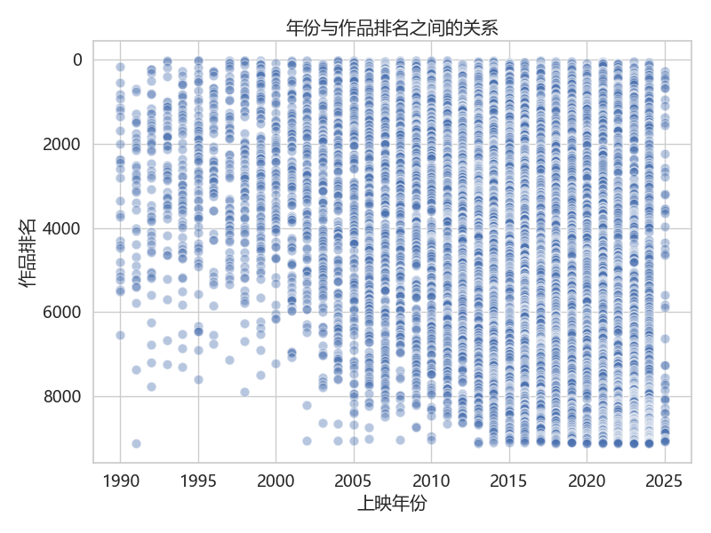
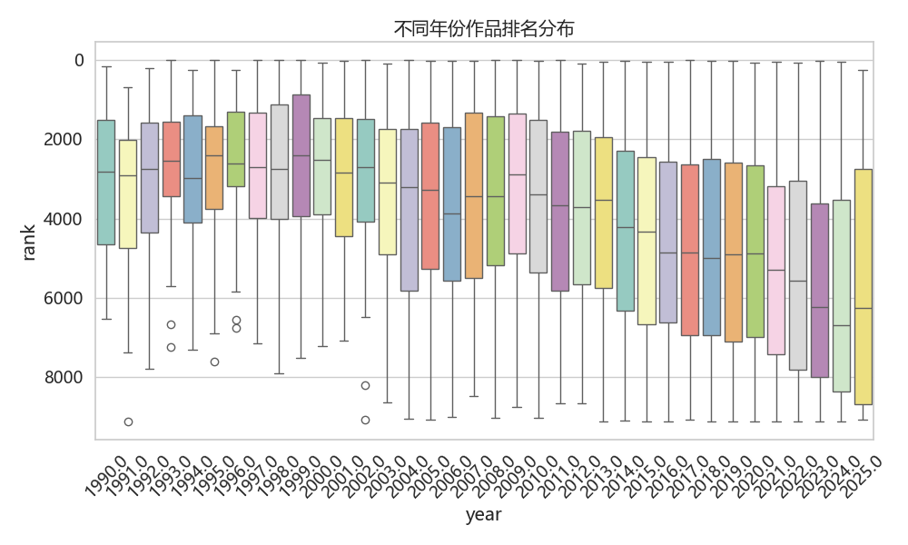
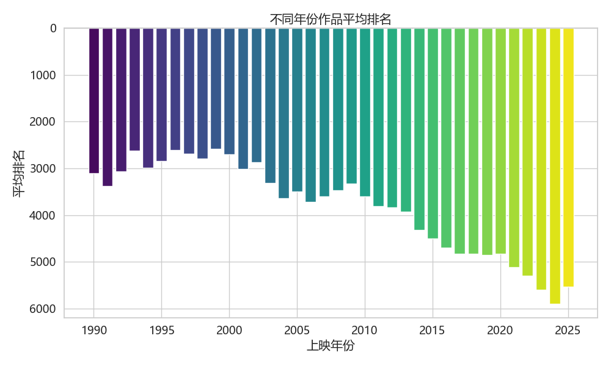
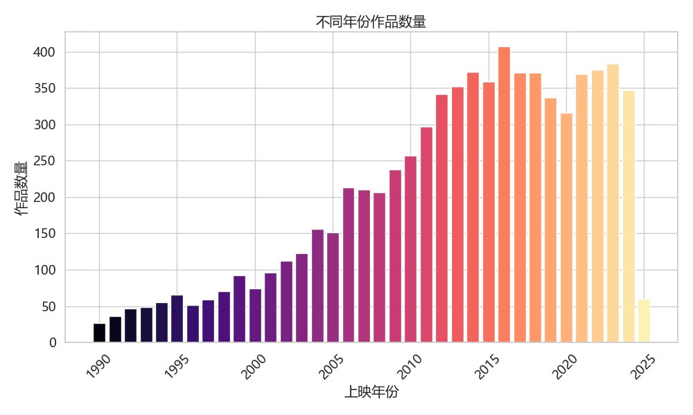
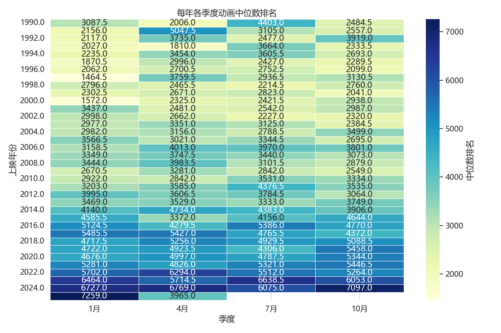
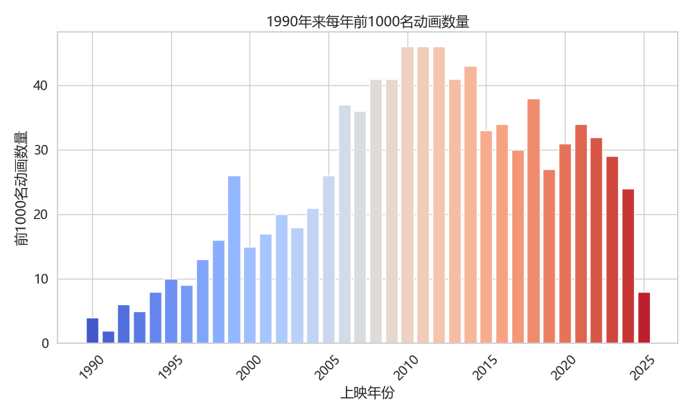

# Bangumi 动画排名数据分析与可视化

## 项目介绍

本项目主要包括数据爬取与数据分析两个部分，目标是探索动画的排名与上映年份之间的关系。项目中使用的数据来源于 Bangumi 网站，共包含约 9000 部动画的信息。

## 项目结构

```
bangumi/
├── data/
│   └── bangumi_ranking.csv
├── scrape.py
├── visualization.py
├── README.md
└── Figures
```

### 文件说明

- `scrape.py`: 从 Bangumi 网站爬取了约9000部动画的排名、上映日期及其他相关信息，并保存为 CSV 文件。
- `visualization.py`: 对爬取的数据进行清洗与分析，生成6个图表，探索动画排名与年份之间的关系。

## 可视化说明

### 图1：年份与作品排名散点图
- 探索动画排名随年份的变化趋势。

### 图2：不同年份作品排名箱线图
- 分析每年动画排名的分布情况，查看排名的集中性与离散程度。

### 图3：每年作品的平均排名柱状图
- 展示不同年份动画的平均排名趋势。

### 图4：不同年份作品数量柱状图
- 分析每年动画作品的发布数量。

### 图5：每年各季度动画的中位数排名热力图
- 展示不同年份各季度的动画排名情况，发现季度间的差异。 

### 图6：1990年以来每年前1000名动画数量柱状图
- 探索各年份高排名（前1000名）动画的数量变化。

## 环境配置

项目依赖环境如下：

```bash
pip install pandas matplotlib seaborn requests beautifulsoup4
```

## 数据来源

- 数据来自：[Bangumi 动画排行榜](https://bangumi.tv/anime/browser/?sort=rank)

## 使用方法

1. **数据爬取**：
```bash
python3 scrape.py
```

2. **数据可视化**：

确保 CSV 文件在 `data` 文件夹中，然后运行：
```bash
python3 visualization.py
```

## 注意事项
请合理控制爬取频率，本项目scrape.py爬取速率约为1.5秒一次，避免对Bangumi服务器造成过大压力

本项目数据基于GPL-3.0 License，仅用于学习研究，请勿用于商业用途

